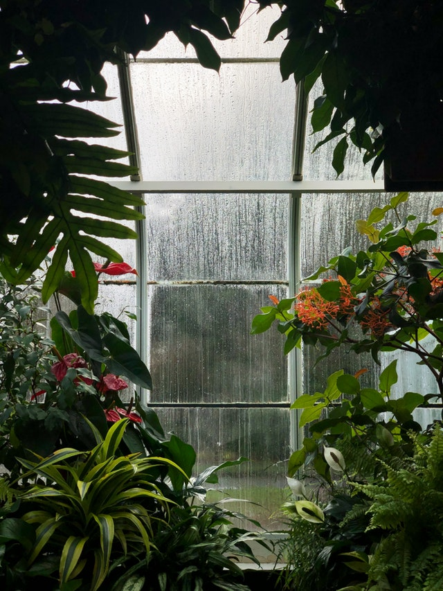

Plants are so interesting. You water them - they grow. You leave them in the dark - they find their way to the light. You leave them in a smaller pot - they'll maintain their size once their root system has overtaken a ton of the soil within. People are just plants with complex emotions.

