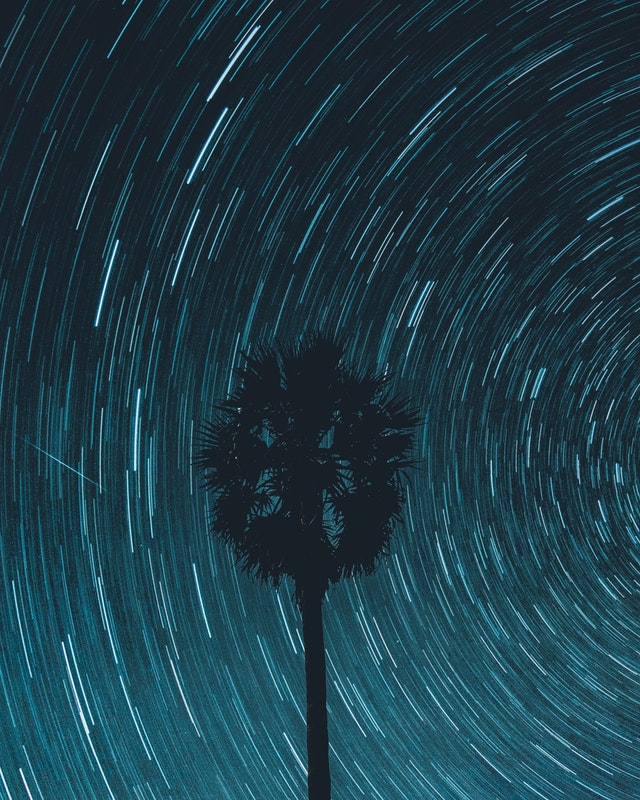

Space: A large, mostly unexplored, vacuum. 

Ever since I was little I always wanted to go to space. Though the fear of dying in the unknown of space terrifies me. To think, there are thousands upon thousands of stars, nebulas, planets even, just floating around there somewhere fascinates me. There could even be other life somewhere! Talk about long-reached Pen Pals.

This is why Space is Cool.

